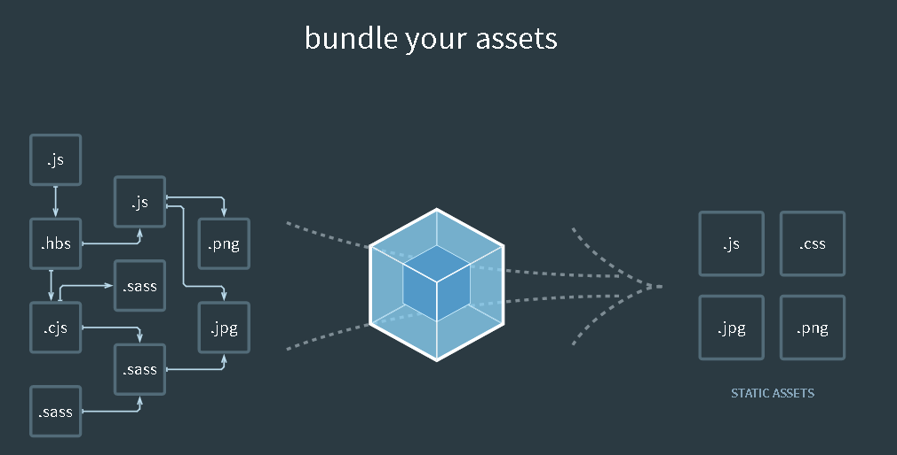

# loaders经验总结
## 目录
[TOC]
## 简介
<!-- 
1.这是什么东西
  将所有的模块转换成js代码，方便webpack做后续的加载
2.能做什么事情
  2.1 怎么做 初级一些的
  2.2 webpack具体如何实现该事情的
3.项目里的运用经验
4.总结 
-->

> <b>Loaders are transformations that are applied on the source code of a module.</b> They allow you to pre-process files as you import or “load” them. Thus, loaders are kind of like “tasks” in other build tools and provide a powerful way to handle front-end build steps. Loaders can transform files from a different language (like TypeScript) to JavaScript or inline images as data URLs. Loaders even allow you to do things like import CSS files directly from your JavaScript modules!

## 常用loader介绍
类型|描述|作用|其他
--|--|--|--
css-loader|||
style-loader|||
ts-loader|||
babel-loader|||
url-loader|||
json-loader|||
raw-loader|||

### 配置方式

### babel-loader细化stage-0至stage-4

## loader实现原理

//todo webpack中是如何运用loader的

## 项目经验

## 总结

## 参考文档

[webpack官方文档](https://webpack.js.org/concepts/loaders/)

https://cs.101.com/v0.1/download?dentryId=a189058c-841b-4813-9604-ea3aba6a181b&session=a8823fa1-69d9-48fb-93c1-63196b2ba09e

https://segmentfault.com/a/1190000005742111